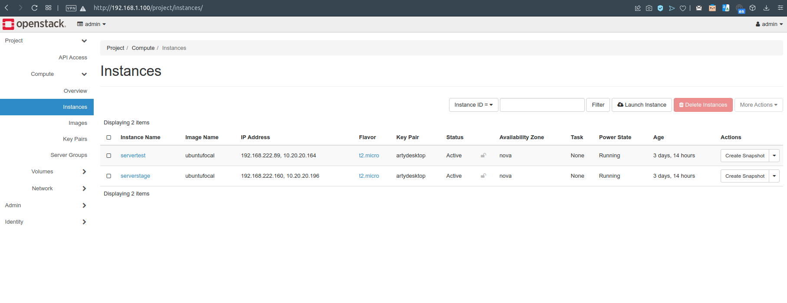
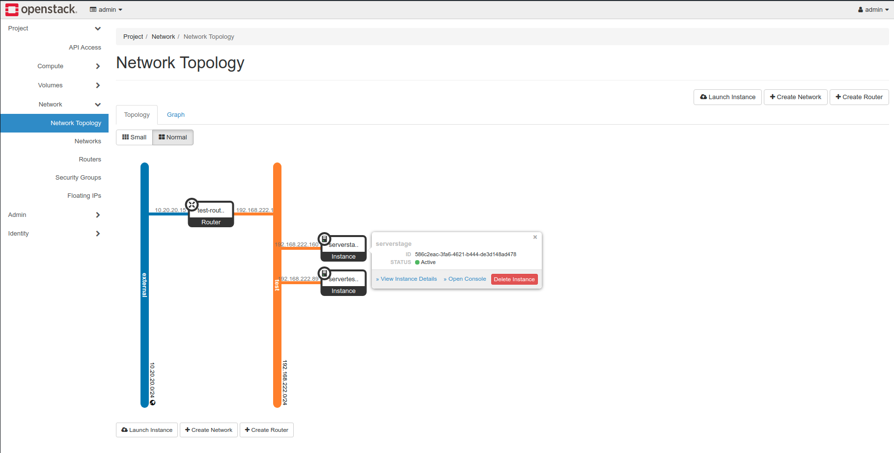
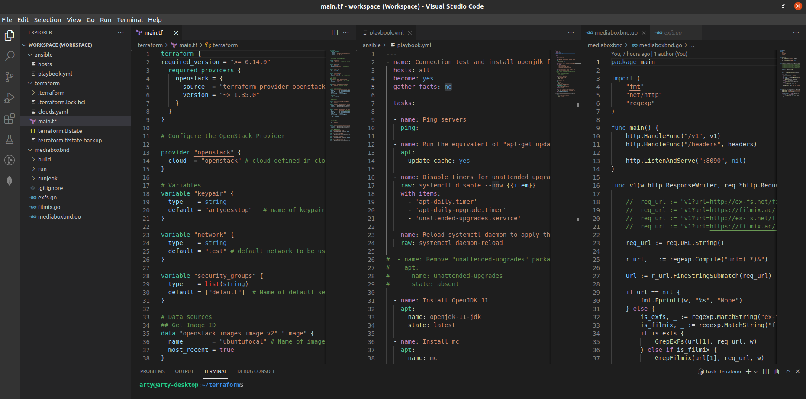
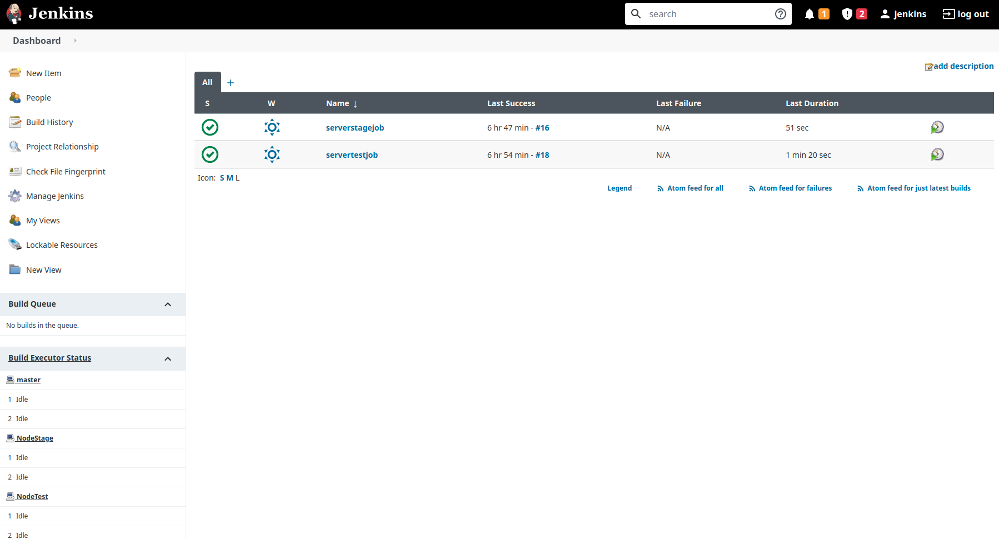
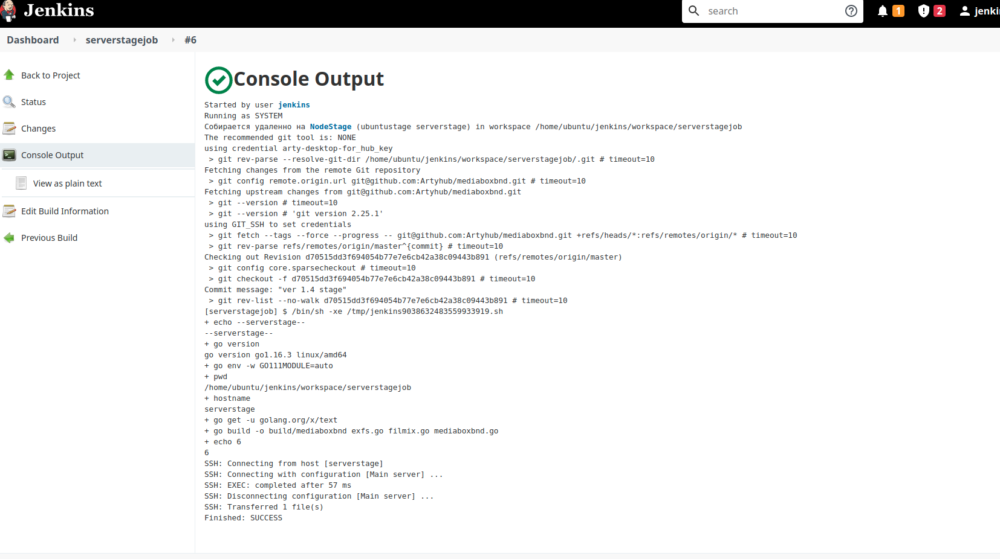
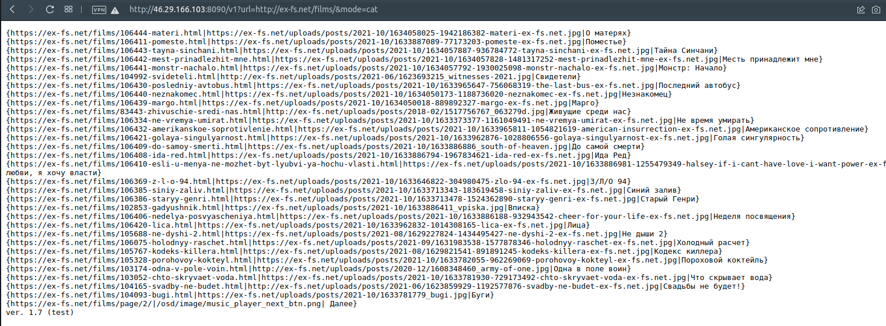
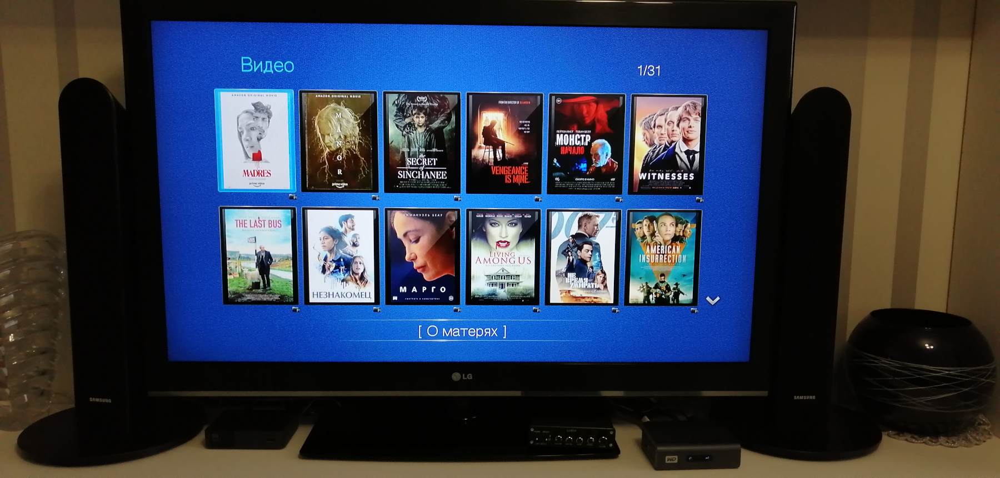

# CI/CD devops project

##  "Mediabox" plugin for WDTV Live Media player

**Instruments:**  

Software:  
  1. Openstack (microstack)  
  2. Terraform  
  3. Ansible  
  4. Jenkins  
  5. Ubuntu (desktop, servers)  
  6. VSCode  
  7. Golang, php  

Hardware:  
  1. WDTV Live Media player  
  2. Desktop (6Gb AMD Phenom X4 945)  
  3. Home Server (Atom D425)  
  4. Home Server (Intel E6500)  

**Draft Images:**  
  1. Openstack (Instances):  
    
  2. Openstack (Network Topology):   
    
  3. VSCode (Ansible playbook, Terraform .tf, Mediabox backend Golang code):  
    
  4. Jenkins (jobs):  
    
  5. Jenkins (job console output):  
    
  6. Mediabox application backend output:  
    
  7. Result from WDTV Live Media player:  
    

